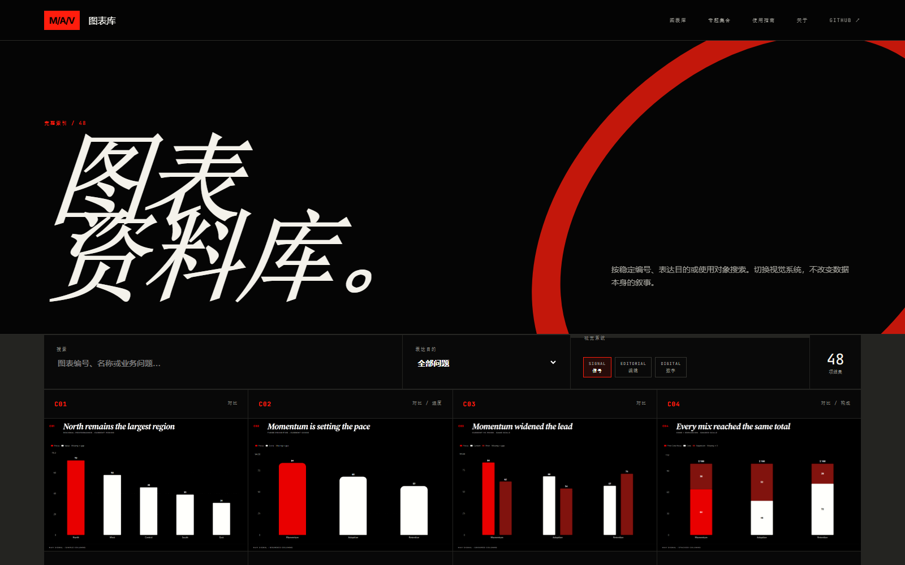

# MAV Charts

MAV Charts 是一个基于 React、Recharts 和 TypeScript 的开源图表库，内置 **48 个可直接用于生产项目的图表模板**。它不是简单展示“有哪些图形”，而是帮助你从实际问题出发，找到合适的图表并快速接入项目。

你可以用它制作经营看板、数据报告、产品后台、研究页面和视频中的数据画面。每个模板都支持三套视觉风格，并带有类型定义、示例数据、响应式布局和无障碍支持。

[在线体验](https://maverickgao8848.github.io/mav-charts/) · [浏览全部 48 个模板](https://maverickgao8848.github.io/mav-charts/library) · [下载 v0.1.0](https://github.com/maverickgao8848/mav-charts/releases/tag/v0.1.0)

## 先看一下效果

网站和图表目录都提供中文说明。第一次使用时，可以先打开在线图表库，按自己要解决的问题筛选，不需要先记住每种图表的英文名称。


## 这个项目适合谁

- 想快速做出专业数据图表的前端开发者
- 不确定“这组数据该用什么图”的产品经理、设计师或数据分析师
- 需要统一图表视觉风格的团队
- 需要兼顾桌面端、移动端、截图和视频画面的项目

如果你只是想找图表，不必先下载代码，直接使用[在线图表库](https://maverickgao8848.github.io/mav-charts/library)即可。

## 最省事的用法：让 AI 帮你接入

如果你正在使用 **Codex、Kimi、WorkBuddy** 或其他能够读取代码的 AI 编程工具，不必先研究 48 个组件，也不必手动照抄下面的代码。把项目交给 AI，再告诉它“数据是什么、想回答什么问题”，让它完成选图、安装和接入。

使用前最好准备两样东西：

1. 你的 React 项目，或者至少提供 `package.json` 和需要放置图表的页面文件
2. 一小段脱敏后的真实数据，以及每个字段代表什么

### 用 Codex

1. 在 Codex 中打开你的 React 项目文件夹。
2. 新建任务，把下面的“通用提示词”发给 Codex。
3. Codex 会读取项目、选择合适的 MAV Charts 模板、安装依赖并修改代码。
4. 完成后重点查看它给出的文件差异和测试结果，再在浏览器里确认图表。

Codex 适合这种直接操作代码库的工作流：它可以理解项目结构、实现修改并运行检查。参见 [OpenAI 官方 Codex 说明](https://developers.openai.com/)。

### 用 Kimi

- 如果你使用的是能打开代码仓库的 Kimi 编程工具：打开项目目录，直接粘贴下面的提示词，并允许它读取文件和运行终端命令。
- 如果你使用的是普通 Kimi 对话：上传 `package.json`、目标页面文件和一小段数据，让它生成完整组件代码；然后把代码复制回项目，并按它给出的命令安装依赖。

### 用 WorkBuddy

1. 在 WorkBuddy 中导入 GitHub 仓库或打开本地工作区。
2. 把下面的提示词作为一个新任务提交。
3. 允许它修改项目文件和运行 `npm` 命令。
4. 完成后先看改动文件，再检查页面效果；不要只根据 AI 的文字回复判断是否成功。

不同版本的 Kimi 或 WorkBuddy，按钮名称可能会有差异。只要找到“打开项目、导入仓库或上传文件”的入口即可，核心是让 AI 能看到你的项目和数据结构。

### 通用提示词：直接帮我接入图表

下面这段可以直接复制给 Codex、Kimi 或 WorkBuddy。把方括号里的内容换成你自己的信息：

```text
请在当前 React 项目中接入 MAV Charts：
https://github.com/maverickgao8848/mav-charts

我的业务问题是：[例如：比较各地区本月销售额]
图表要放在：[页面或组件路径；不确定时请自行查找合适位置]
数据来源是：[接口、已有变量或文件路径]
数据字段含义：[例如 region=地区，sales=销售额，单位为万元]
视觉风格：[signal / editorial / digital；不确定时使用 signal]

请完成以下工作：
1. 先根据业务问题选择最合适的 MAV Charts 模板，并用一句话说明理由。
2. 安装缺少的依赖，优先使用 @mav-charts/charts 的子路径引入。
3. 使用现有真实数据，不要擅自编造业务数据或改变接口。
4. 标题、分类名称、提示信息和单位全部使用中文。
5. 缺失值使用 null，不要把缺失值写成 0。
6. 保持当前项目的代码风格和响应式布局。
7. 完成后运行项目已有的类型检查或测试，并修复由本次修改导致的问题。
8. 最后告诉我：选择了哪个模板、修改了哪些文件、如何在本地查看。
```

如果 AI 无法直接修改文件，再补充一句：

```text
你现在不能直接修改我的项目，请给我完整可复制的组件代码、安装命令、需要新增或替换的文件路径，以及逐步操作说明。
```

### 通用提示词：先帮我选图，不要改代码

还没想好用什么图时，可以先这样问：

```text
请根据 MAV Charts 的 48 个模板帮我选图，暂时不要修改代码。

我想回答的问题是：[你的业务问题]
数据样例：[粘贴 5～10 条脱敏数据]
使用场景：[经营看板 / 汇报 / 手机页面 / 视频 / 研究报告]

请推荐 1 个首选模板和最多 2 个备选模板，说明各自适合与不适合的原因，
并列出接入首选模板前还需要我补充哪些信息。
```

### 给 AI 的信息越具体，结果越可靠

不要只说“帮我做个好看的图”。至少告诉 AI：

- 想回答的业务问题，而不只是数据列名
- 数据字段的含义、单位和时间范围
- 图表要放在哪个页面、给谁看
- 是否需要移动端、深色背景或截图使用
- 哪些现有接口和页面结构不能改

## 想自己操作？按下面三步开始

### 第一步：先说清楚你要回答什么问题

在图表库中，可以按“对比、趋势、构成、分布、关系、流向、进度”等业务问题筛选。例如：

| 你想回答的问题 | 可以先看 |
|---|---|
| 哪个地区的销售额最高？ | 基础柱状图、横向排名图 |
| 最近 12 个月增长了吗？ | 趋势折线图、趋势面积图 |
| 各渠道贡献占比是多少？ | 饼图、环形图、百分比堆叠图 |
| 两个指标之间有关联吗？ | 散点图、回归图 |
| 当前完成进度是多少？ | 径向进度图、仪表盘 |



### 第二步：选择视觉风格

同一个图表可以切换三套视觉系统，数据结构和图表含义不会改变：

- `signal`：黑底、高对比、红色重点，适合汇报、咨询和视频画面
- `editorial`：硬朗、克制，适合报告、研究和工程类内容
- `digital`：深色、精细、技术感，适合 AI、SaaS 和监控面板

不知道选哪个时，先用默认的 `signal` 即可。

### 第三步：安装到 React 项目

项目需要 React 18 或 19，以及 Recharts 3。

```bash
npm install @mav-charts/charts @mav-charts/themes recharts react react-dom
```

然后在页面中引入需要的图表。下面是一份可以直接修改的中文示例：

```tsx
import { SimpleColumnChart } from "@mav-charts/charts/C01-simple-columns";

const salesData = [
  { label: "华东", value: 72, detail: "本月最高" },
  { label: "华南", value: 58 },
  { label: "华北", value: 46 },
  { label: "西南", value: 39 },
];

export function RegionalSales() {
  return (
    <SimpleColumnChart
      data={salesData}
      visualSystem="signal"
      title="各区域销售额对比"
      subtitle="2026 年 8 月"
      unit="万元"
    />
  );
}
```

推荐像示例一样使用子路径引入，例如 `@mav-charts/charts/C01-simple-columns`。这样应用只会打包实际使用的模板。

## 准备数据时要注意什么

以基础柱状图为例，每条数据至少包含名称和数值：

```ts
type SimpleColumnDatum = {
  label: string;
  value: number | null;
  detail?: string;
};
```

- `label` 是显示在图表上的名称，同一组数据中不要重复
- `value` 是真实数值，不要为了“好看”手动缩放数据
- 数据缺失时使用 `null`，不要用 `0` 冒充缺失值
- `detail` 是可选补充说明，会用于提示和无障碍信息

每个模板目录中都有自己的 `README.md`、类型定义和示例数据。遇到不确定的字段时，可以从对应模板的文档开始看。

## 在本地运行完整项目

如果你想查看源码、修改模板或参与开发：

```bash
git clone https://github.com/maverickgao8848/mav-charts.git
cd mav-charts
npm install
npm run dev
```

终端显示本地地址后，在浏览器中打开它即可。项目的中文使用手册也整理了选图、数据真实性、无障碍和动效方面的基本原则。


提交修改前，建议运行：

```bash
npm run check
npm run test:visual
```

`npm run check` 会执行包构建、TypeScript 类型检查、单元测试和网站构建；`npm run test:visual` 会运行 Playwright 视觉回归测试。

## 项目包含哪些包

| 包名 | 用途 |
|---|---|
| `@mav-charts/charts` | 48 个图表组件和公开类型 |
| `@mav-charts/themes` | Signal、Editorial、Digital 三套视觉系统 |
| `@mav-charts/motion` | 动效策略、截图模式和减少动效支持 |
| `@mav-charts/catalog` | 图表编号、名称、分类和目录元数据 |
| `@mav-charts/examples` | 可复用、可测试的示例数据 |

## 为什么可以放心用于真实项目

- 48 个模板都有固定编号和 TypeScript 类型
- 支持宽屏、标准、卡片、移动端和缩略图尺寸
- 支持键盘操作、屏幕阅读器数据表和减少动效偏好
- 覆盖缺失值、负数、极端值、长标签和无效数据等常见情况
- 支持 SSR、ESM、子路径引入和 tree-shaking
- 组件、在线网站和文档共用同一份图表目录数据

完整的产品与交付说明见 [`docs/MAV_CHARTS_PLAN.md`](docs/MAV_CHARTS_PLAN.md)。

## 参与贡献

欢迎提交问题、改进文档或补充真实业务场景。开始前请阅读 [贡献指南](CONTRIBUTING.md)、[行为准则](CODE_OF_CONDUCT.md) 和 [安全说明](SECURITY.md)。

MAV Charts 使用 [MIT License](LICENSE)；依赖和字体声明见 [THIRD_PARTY_LICENSES.md](THIRD_PARTY_LICENSES.md)。
