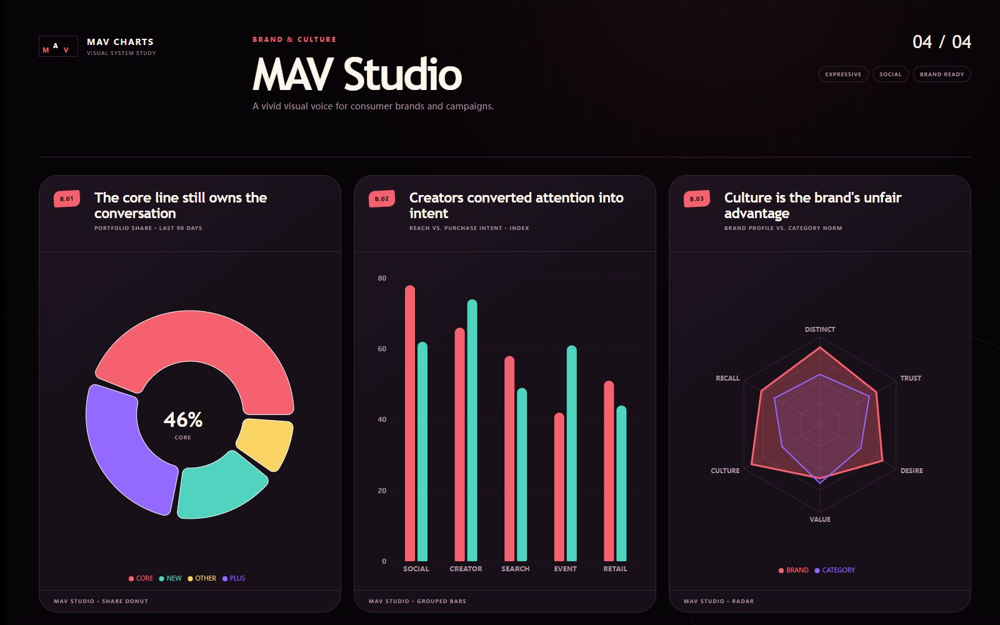
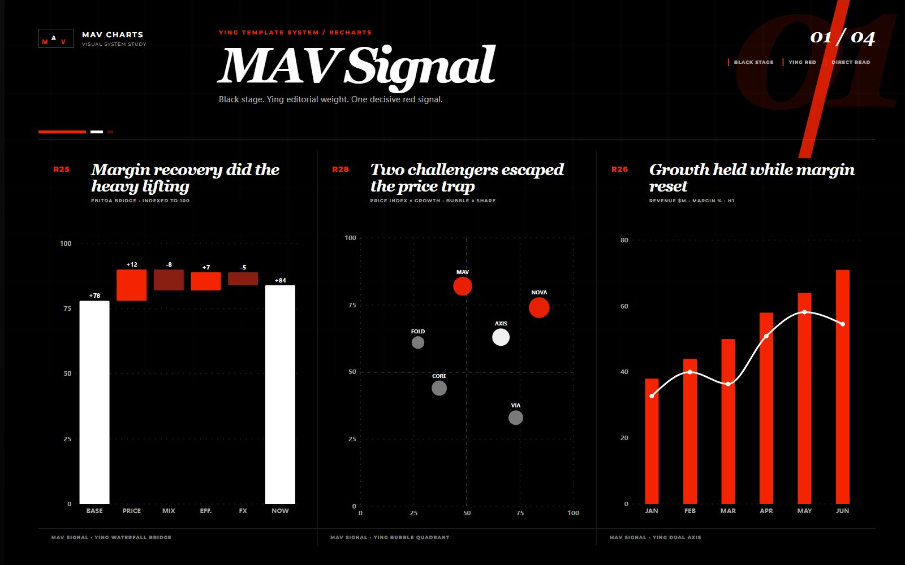
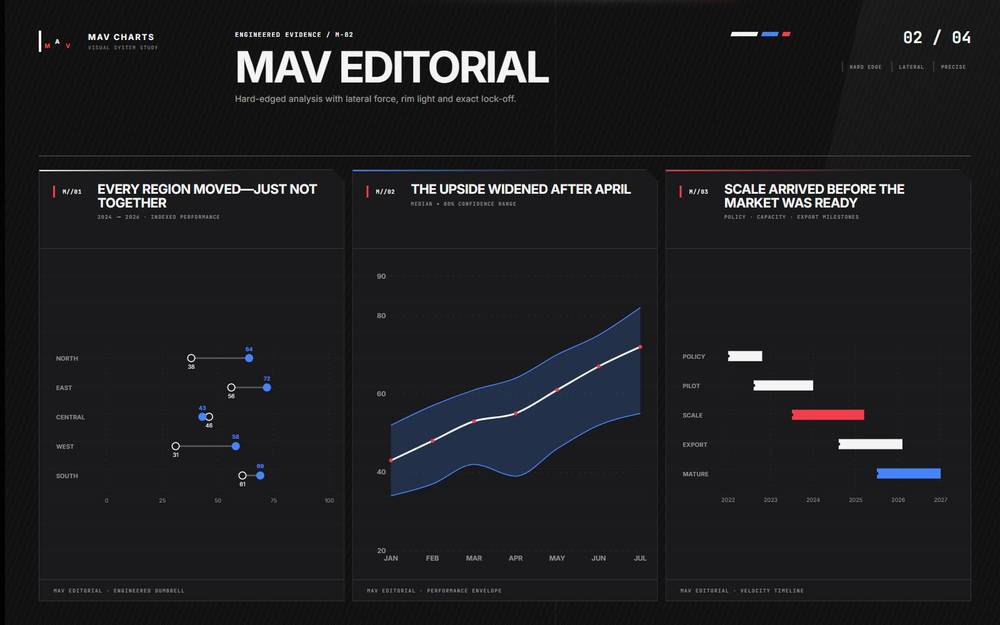
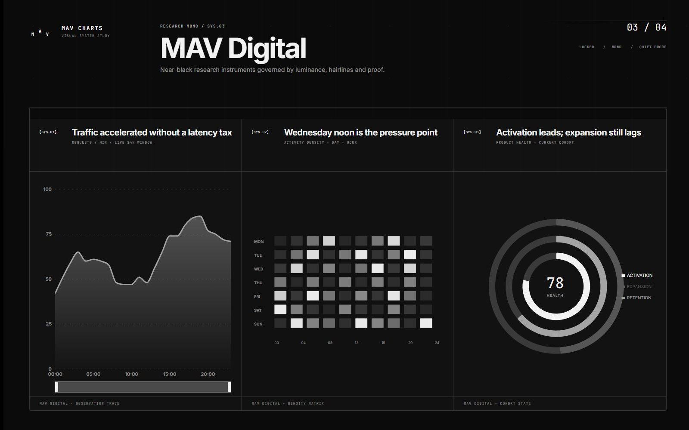

# MAV Charts

MAV Charts is a production-grade React and Recharts library of 48 semantic chart templates. Each template starts from a real communication question, preserves honest geometry, and ships in three visual systems: Signal, Editorial, and Digital.

**[Explore the live Library →](https://maverickgao8848.github.io/mav-charts/)** · [Browse all 48 templates](https://maverickgao8848.github.io/mav-charts/library) · [Download v0.1.0](https://github.com/maverickgao8848/mav-charts/releases/tag/v0.1.0)



## Highlights

- 48 stable, typed chart components with fixed V1 IDs
- Signal, Editorial, and Digital token systems
- Responsive wide, standard, card, mobile, and true 25% thumbnail layouts
- Keyboard navigation, screen-reader tables, reduced-motion support, and browser Axe coverage
- Deterministic fixtures for missing, signed, extreme, long-label, and invalid data
- SSR-safe ESM packages with independent subpath imports and tree-shaking
- A single typed catalog shared by source documentation and the live Library site

## Install

```bash
npm install @mav-charts/charts @mav-charts/themes recharts react react-dom
```

## Quick start

```tsx
import {
  SimpleColumnChart,
  simpleColumnExample,
} from "@mav-charts/charts/C01-simple-columns";

export function RevenueComparison() {
  return (
    <SimpleColumnChart
      data={simpleColumnExample}
      visualSystem="signal"
      title="Regional revenue"
      subtitle="Reported value by region"
      unit="$M"
    />
  );
}
```

Every stable component also has a root export from `@mav-charts/charts`. Prefer subpath imports when an application only needs a small set of templates.

## Visual systems

### Signal

Pure black editorial stage, MAV Chiron hierarchy, crisp white context, and one decisive red signal.



### Editorial

Hard-edged analytical framing with lateral energy and sparse cold/red accents.



### Digital

Near-black research canvas, monochrome evidence, hairlines, and quiet technical annotation.



## Packages

| Package | Purpose |
|---|---|
| `@mav-charts/charts` | 48 chart components and their public types |
| `@mav-charts/themes` | Three visual systems and CSS token helpers |
| `@mav-charts/motion` | Motion policies and capture/reduced-motion behavior |
| `@mav-charts/catalog` | Typed metadata and the exact 48-ID public union |
| `@mav-charts/examples` | Shared deterministic example data |

The complete catalog and delivery contract are documented in [`docs/MAV_CHARTS_PLAN.md`](docs/MAV_CHARTS_PLAN.md). Every catalog item links to a fixed component source directory under `packages/charts/src`.

## Development

```bash
npm install
npm run dev
npm run check
npm run test:visual
```

`npm run check` performs strict TypeScript checking, 641 unit/component/SSR assertions, all package builds, and the Library production build. The Playwright suite owns the 1,249 visual baselines and accessibility/console checks.

## Publishing

All public workspaces build to ESM JavaScript plus declaration files. `npm pack` runs the package build automatically; the published tarballs exclude source tests and visual artifacts. Version changes are managed with Changesets.

## Community and security

See [CONTRIBUTING.md](CONTRIBUTING.md), [CODE_OF_CONDUCT.md](CODE_OF_CONDUCT.md), and [SECURITY.md](SECURITY.md). MAV Charts is released under the [MIT License](LICENSE); dependency and font notices are in [THIRD_PARTY_LICENSES.md](THIRD_PARTY_LICENSES.md).
