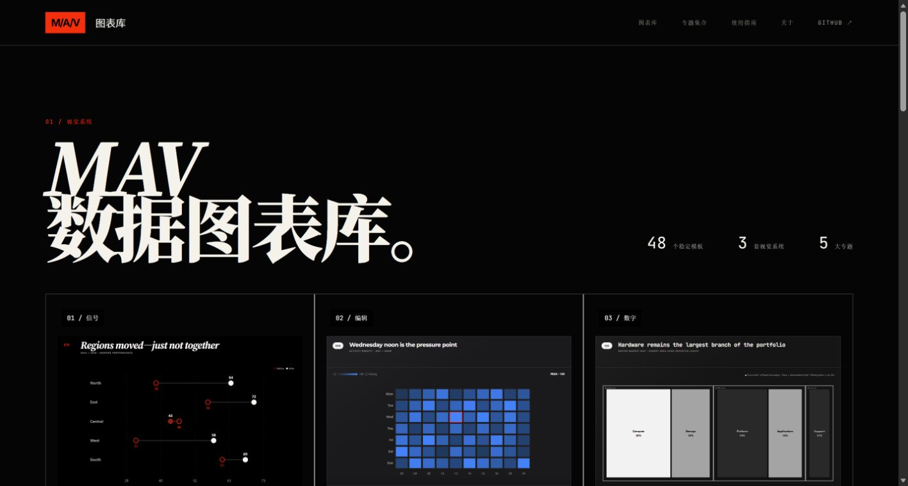
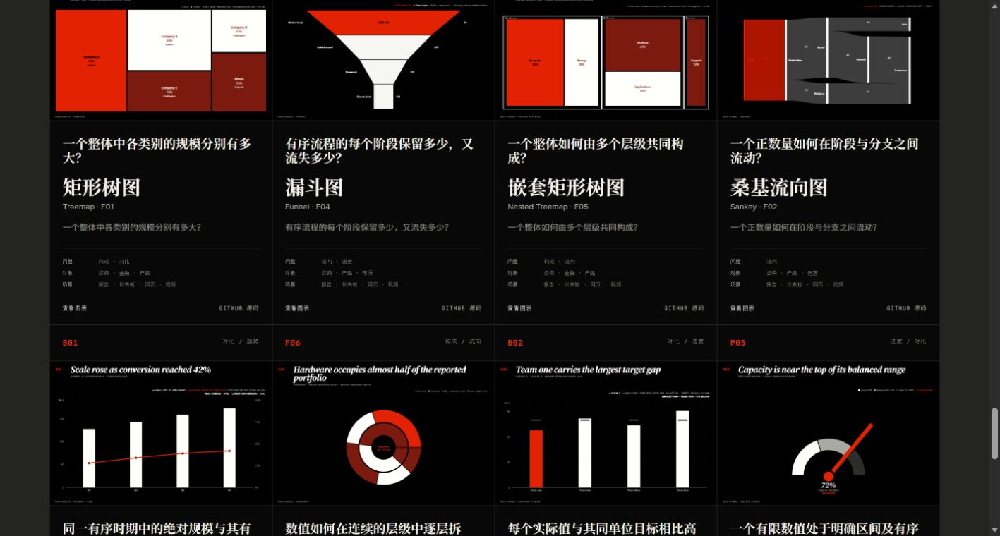
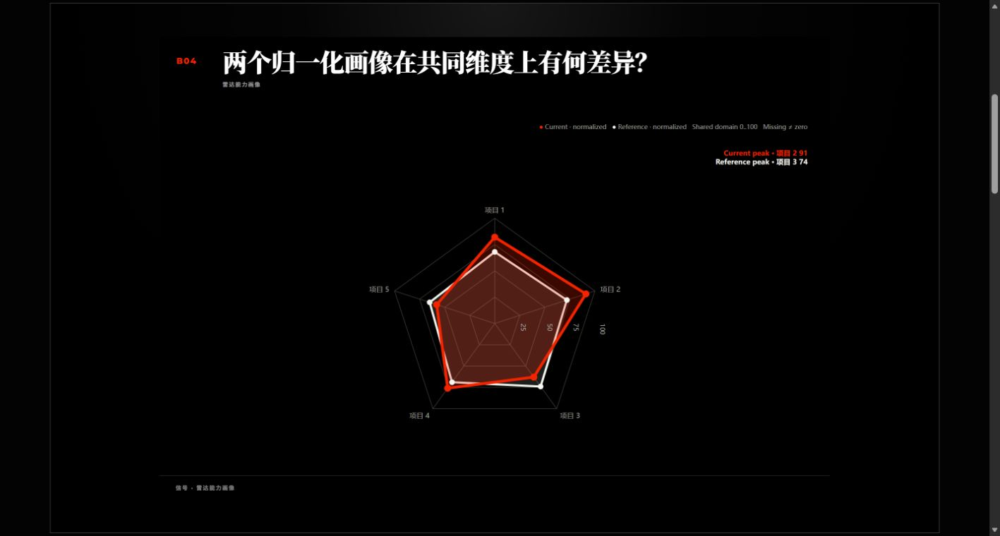

# MAV Charts

不会选图表，也不会写代码？直接把数据和想法交给 **MAV Chart Maker**。

这是一个可以独立安装的 Codex Skill，内置 48 个 MAV Charts 模板。它会先听懂你想说明什么，再帮你选图、让你挑风格、向你索要真正需要的数据，最后做成图片、PPT、网页或 React 组件。

**先逛网站：** [MAV 数据图表库首页](https://maverickgao8848.github.io/mav-charts/) · [浏览全部 48 个图表](https://maverickgao8848.github.io/mav-charts/library) · [看使用指南](https://maverickgao8848.github.io/mav-charts/guides)



## 它会替你做什么

你不用先知道“应该用柱状图还是雷达图”。只要说清楚一句业务问题，例如：

> 我想比较两个团队在五项能力上的差异，最后放进汇报 PPT。

Skill 会按这个顺序带你完成：

1. 从网站和内置目录的 48 个模板里推荐最合适的图。
2. 给你真实页面链接，让你看到首选和备选长什么样。
3. 让你明确选择 `Signal`、`Editorial` 或 `Digital`。
4. 根据所选模板，向你索要对应字段、单位、标题和数据。
5. 问你想做成图片、PPT、网页、React 组件还是视频画面。
6. 用真实 MAV 组件制作、检查并交付。

它不会随便编数据，不会把缺失值当成 `0`，也不会换成旧模板或普通图表将就。

## 先看看有没有喜欢的图

[打开完整图表库](https://maverickgao8848.github.io/mav-charts/library)，可以按“对比、趋势、构成、分布、关系、流向、进度”筛选。你不必记英文名称。

下面这一排是[矩形树图](https://maverickgao8848.github.io/mav-charts/charts/F01?system=signal)、[漏斗图](https://maverickgao8848.github.io/mav-charts/charts/F04?system=signal)、[嵌套矩形树图](https://maverickgao8848.github.io/mav-charts/charts/F05?system=signal)和[桑基流向图](https://maverickgao8848.github.io/mav-charts/charts/F02?system=signal)：



如果不想自己逛，也可以跳过这一步，直接让 Skill 推荐。

## 三种风格，你来选

- `Signal`：黑底、高对比、红色重点，适合汇报、咨询和视频。
- `Editorial`：硬朗、克制、精确，适合报告、研究和正式演示。
- `Digital`：深色、精细、技术感，适合 AI、SaaS 和监控面板。

Skill 可以推荐，但不会替你默选。确定模板后，它会给出三个直达链接，让你在网站上比较同一张图的三种风格。

例如“雷达能力画像 B04”： [Signal](https://maverickgao8848.github.io/mav-charts/charts/B04?system=signal) · [Editorial](https://maverickgao8848.github.io/mav-charts/charts/B04?system=editorial) · [Digital](https://maverickgao8848.github.io/mav-charts/charts/B04?system=digital)

## 一个完整例子：雷达能力画像

如果你想比较两个团队、品牌、方案或人物在共同维度上的差异，Skill 可能会推荐 [B04 雷达能力画像](https://maverickgao8848.github.io/mav-charts/charts/B04?system=signal)。



### 1. 先判断适不适合

每个图表详情页都会直接告诉你“什么时候用”和“不适合什么”。


### 2. 按提示准备数据

不用懂 TypeScript。以雷达能力画像为例，只要准备名称、数值、对比值和可选说明。Skill 也会在聊天里主动向你索要这些内容。


### 3. 让 Agent 开始制作

网站会给出可复制的说明；安装本 Skill 后更简单，直接告诉它最终要做成什么即可。


## 安装

### 最简单：交给 Skill Installer

在 Codex 中发送：

```text
请使用 $skill-installer 安装这个 Skill：
https://github.com/maverickgao8848/mav-charts
```

### 安装到当前项目

```bash
git clone https://github.com/maverickgao8848/mav-charts.git .agents/skills/mav-chart-maker
```

这样团队在这个项目里都可以使用它。

### 安装到自己的电脑

```bash
git clone https://github.com/maverickgao8848/mav-charts.git ~/.agents/skills/mav-chart-maker
```

这样可以在不同项目中使用。如果 Codex 没有马上发现新 Skill，重启一次即可。

## 直接复制这个用法

```text
$mav-chart-maker

我想表达：[例如：两个团队在五项能力上的差异]
我的数据：[粘贴表格，或说明稍后上传 Excel / CSV]
使用场景：[例如：给管理层做月度汇报]
最终想要：[例如：一页 16:9 PowerPoint]

请先推荐合适的 MAV 模板，给我网站预览链接；
然后让我选择 Signal、Editorial 或 Digital；
再告诉我还需要补充哪些数据，最后直接帮我做出来。
```

没准备好数据也没关系，可以更简单：

```text
$mav-chart-maker 我想做一张能说明各渠道收入贡献的图，最后放进 PPT，你带着我一步一步做。
```

## 更多网站入口

- 按人群找图：[咨询](https://maverickgao8848.github.io/mav-charts/collections/consulting) · [金融](https://maverickgao8848.github.io/mav-charts/collections/finance) · [产品](https://maverickgao8848.github.io/mav-charts/collections/product) · [市场](https://maverickgao8848.github.io/mav-charts/collections/marketing) · [运营](https://maverickgao8848.github.io/mav-charts/collections/operations)
- [完整图表库](https://maverickgao8848.github.io/mav-charts/library)
- [使用指南](https://maverickgao8848.github.io/mav-charts/guides)
- [关于 MAV Charts](https://maverickgao8848.github.io/mav-charts/about)

Skill 也会在实际对话中主动给出当前最相关的入口：推荐时直达具体图表，选风格时直达三种预览，索要数据时回到图表详情说明，交付时保留最终模板链接。

## 它为什么可以搬到别的仓库使用

这个 GitHub 仓库本身就是完整 Skill 文件夹，模板、三种风格、字体、预览、schema、验证规则和 React 组件都在 `assets/mav-charts` 里。Skill 永远从自己的 `SKILL.md` 定位这些文件，不需要宿主仓库预先安装 MAV Charts。

运行检查：

```bash
node scripts/check-portability.mjs
```

工作流细节见 [`SKILL.md`](SKILL.md)。MAV Charts 使用 [MIT License](LICENSE)。
